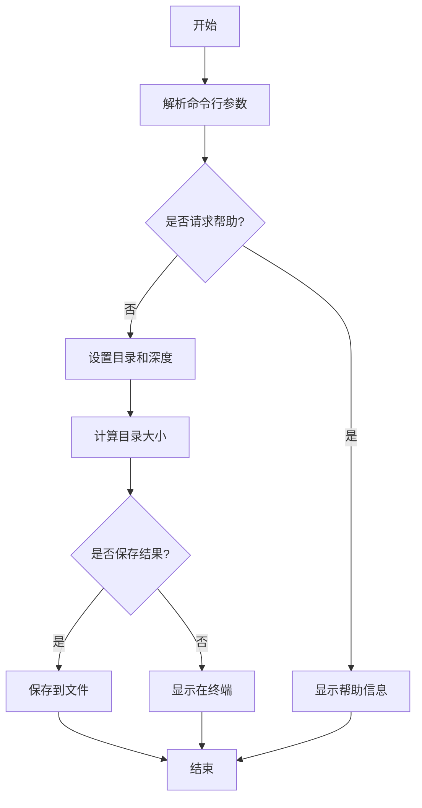

# 🔍 ADU - 高级目录使用率工具

> ADU (Advanced Directory Usage) 是一个用于计算目录大小的 Shell 脚本工具，可以帮助您快速找出占用空间较大的目录。通过彩色输出和直观的数据展示，让您轻松管理磁盘空间！

---

## ✨ 功能特点

- 📊 计算指定目录的大小
- 🔢 支持自定义搜索深度
- 🚫 自动排除非目标挂载点
- 📏 只显示以 GB 为单位的目录（节省输出空间）
- 💾 支持将结果保存到文件中
- 🌈 丰富的彩色输出，提高可读性和用户体验
- 📈 清晰的进度提示和结果展示

---

## 📖 使用方法

```bash
# 基本用法
./adu.sh [目录路径] [深度] [选项]
```

### 📝 参数说明

| 参数 | 说明 | 默认值 |
|------|------|--------|
| `目录路径` | 要计算大小的目录 | `/` (根目录) |
| `深度` | 要搜索的目录深度 | `5` |
| `选项` | 附加功能选项 | - |

#### 🛠️ 可用选项

| 选项 | 说明 |
|------|------|
| `-h, --help` | 显示帮助信息 |
| `-s, --submit` | 将结果保存到文件 |

---

### 🌟 示例

1. 📂 计算根目录下深度为 3 的目录大小：
   ```bash
   # 分析根目录，深度为3
   ./adu.sh / 3
   ```

2. 🏠 计算 /home 目录下深度为 2 的目录大小：
   ```bash
   # 分析home目录，深度为2
   ./adu.sh /home 2
   ```

3. 📁 计算 /var 目录并将结果保存到文件：
   ```bash
   # 分析var目录，深度为3，并保存结果
   ./adu.sh /var 3 -s
   ```

4. ❓ 显示帮助信息：
   ```bash
   # 显示帮助
   ./adu.sh --help
   ```

---

## 🔄 工作流程



---

## ⚠️ 注意事项

- 🔐 **脚本需要有足够的权限访问目标目录**
- ⏱️ **计算大型目录可能需要较长时间**
- 📄 **结果文件将保存在当前目录下，格式为：** `dir_size_YYYYMMDD_HHMMSS.txt`

---

## 📊 输出文件格式

| 字段 | 说明 |
|------|------|
| 计算开始时间 | 任务开始的日期和时间 |
| 目录 | 被分析的目录路径 |
| 深度 | 搜索的目录深度 |
| 大小 | 目录大小（GB） |
| 路径 | 目录的完整路径 |
| 计算结束时间 | 任务完成的日期和时间 |