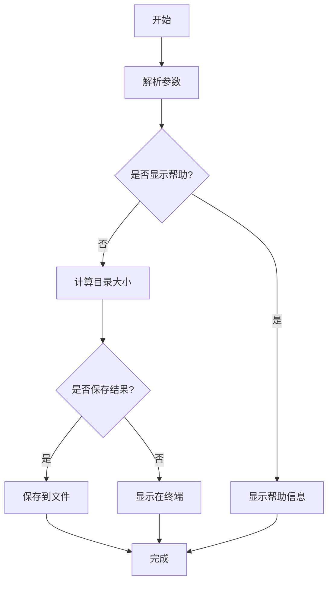

# 🚀 ADU - 高级目录使用率工具

> ADU (Advanced Directory Usage) 是一个用于计算目录大小的 Shell 脚本工具，可以帮助您快速找出占用空间较大的目录。

## ✨ 功能特点

- 🔍 **智能扫描**：计算指定目录的大小
- 📏 **灵活配置**：支持自定义搜索深度
- 🚫 **自动过滤**：自动排除非目标挂载点
- 💾 **高效输出**：只显示以 GB 为单位的目录（节省输出空间）
- 💾 **结果保存**：支持将结果保存到文件中
- 🌈 **彩色显示**：丰富的彩色输出，提高可读性和用户体验
- ⏳ **进度提示**：清晰的进度提示和结果展示

## 📊 核心函数

| 函数名称 | 功能描述 | 输出示例 |
|----------|----------|----------|
| `show_help()` | 显示帮助信息 | ![帮助信息] |
| `calculate_dir_size()` | 计算目录大小 | 2.5G /var/log |
| `main()` | 主控制流程 | 处理参数并调用其他函数 |

## 🔧 使用方法



## 🛠️ 使用方法

```bash
./adu.sh [目录路径] [深度] [选项]
```

### 📌 参数说明

| 参数 | 描述 | 默认值 |
|------|------|--------|
| `目录路径` | 要计算大小的目录 | `/` |
| `深度` | 要搜索的目录深度 | `5` |
| `-h, --help` | 显示帮助信息 | - |
| `-s, --submit` | 将结果保存到文件 | - |

### 🚦 示例

#### 1️⃣ 基本用法
```bash
# 计算根目录下深度为3的目录大小
./adu.sh / 3
```

#### 2️⃣ 指定目录
```bash
# 计算/home目录下深度为2的目录大小
./adu.sh /home 2
```

#### 3️⃣ 保存结果
```bash
# 计算/var目录并将结果保存到文件
./adu.sh /var 3 -s
```

#### 4️⃣ 获取帮助
```bash
# 显示帮助信息
./adu.sh --help
```

#### 5️⃣ 彩色输出示例
```bash
# 计算/usr目录下深度为4的目录大小（彩色输出）
./adu.sh /usr 4
```

> 💡 **提示**：
> - 使用 `-s` 参数时，结果文件将保存在当前目录下
> - 文件名格式为 `dir_size_YYYYMMDD_HHMMSS.txt`
> - 彩色输出在支持ANSI颜色的终端中效果最佳

## ⚠️ 注意事项

- 🔒 **权限要求**：脚本需要有足够的权限访问目标目录
- ⏱️ **性能考虑**：计算大型目录可能需要较长时间
- 💾 **文件保存**：结果文件将保存在当前目录下，格式为 `dir_size_YYYYMMDD_HHMMSS.txt`
- 🌈 **终端兼容**：彩色输出需要支持ANSI颜色的终端
- 📁 **目录限制**：不支持网络挂载目录的计算

## 📜 版本信息

| 版本 | 日期 | 更新内容 |
|------|------|----------|
| v1.0 | 2025-08-20 | 初始版本 |
| v1.1 | 2025-08-25 | 添加彩色输出和函数化 |

## 📥 下载与安装

### 方法一：直接下载

```bash
# 克隆仓库
git clone https://github.com/wangb335/adu.git

# 进入项目目录
cd adu

# 添加执行权限
chmod +x adu.sh
```

### 方法二：一键安装

```bash
# 下载并安装
curl -sSL https://github.com/wangb335/adu/raw/main/install.sh | bash

# 或者使用 wget
wget -qO- https://github.com/wangb335/adu/raw/main/install.sh | bash
```

## 🤝 贡献指南

欢迎为 ADU 项目做出贡献！以下是参与方式：

1. Fork 本仓库
2. 创建您的特性分支 (`git checkout -b feature/amazing-feature`)
3. 提交您的更改 (`git commit -m 'Add some amazing feature'`)
4. 推送到分支 (`git push origin feature/amazing-feature`)
5. 打开一个 Pull Request

## 📄 许可证

本项目采用 MIT 许可证 - 详情请参阅 [LICENSE](https://github.com/wangb335/adu/blob/main/LICENSE) 文件